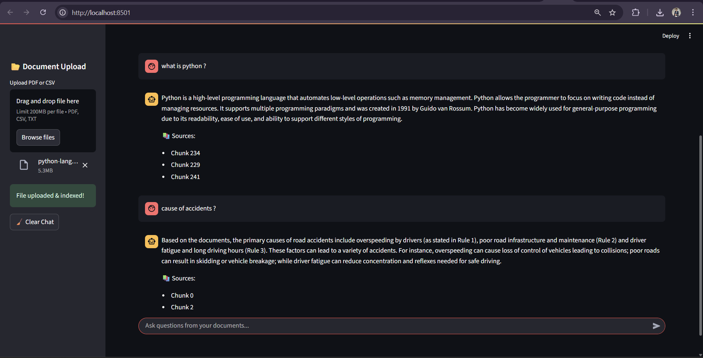

# 🤖 GenAI RAG Intelligent Assistant

An intelligent document question-answering assistant powered by **Retrieval-Augmented Generation (RAG)** and **Local Large Language Models (LLMs)**.

The assistant allows users to upload documents (PDF, CSV, TXT) and ask questions conversationally. Answers are generated using retrieved document context, reducing hallucination and ensuring grounded responses.

---

## 🚀 Features

✅ Upload PDF, CSV, or TXT documents  
✅ Automatic document ingestion and indexing  
✅ Semantic search using FAISS vector database  
✅ Retrieval-Augmented Generation (RAG) pipeline  
✅ Local LLM-based response generation  
✅ Source citation for transparency  
✅ Interactive chat UI  
✅ Dynamic knowledge updates

---

## 🧠 How It Works

1. Documents are uploaded via UI or API.
2. Text is extracted and split into chunks.
3. Embeddings are generated using Sentence Transformers.
4. Embeddings are stored in FAISS vector database.
5. User questions are converted to embeddings.
6. Relevant chunks are retrieved.
7. Local LLM generates grounded answer.
8. Answer and sources are returned to user.

---

## 📸 Demo Screenshots

### Chat Interface

## 🏗️ Architecture

User Query
↓
Chat UI (Streamlit)
↓
FastAPI Backend
↓
Retriever (FAISS)
↓
Relevant Document Chunks
↓
Local LLM (Ollama)
↓
Answer + Sources

## 📂 Project Structure

genai-rag-data-assistant/
│
├── app/
│ ├── api/
│ ├── ingestion/
│ ├── retrieval/
│ └── llm/
│
├── data/raw/
├── embeddings/
├── ui.py
├── build_index.py
├── requirements.txt
└── README.md

## 👨‍💻 Author

**Shaikh Hajisab**  
Contact: hajisk89999@gmail.com
